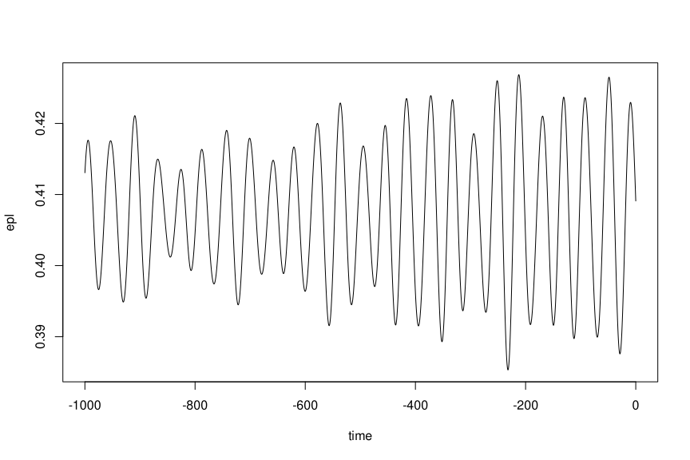

<!-- README.md is generated from README.Rmd. Please edit that file -->

# snvecR

<!-- badges: start -->

[](https://zenodo.org/badge/latestdoi/627092810)
[](https://CRAN.R-project.org/package=snvecR)
[](https://cran.r-project.org/package=snvecR)
[](https://github.com/japhir/snvecR/blob/master/LICENSE.md)
[](https://github.com/japhir/snvecR/releases)
[](https://github.com/japhir/snvecR/actions/workflows/check-standard.yaml)
[](https://mybinder.org/v2/gh/japhir/snvecR/main)
<!-- badges: end -->

Easily calculate precession and obliquity from an astronomical solution
(AS, defaults to ZB18a from Zeebe and Lourens (2019)) and assumed or
reconstructed values for tidal dissipation (T<sub>d</sub>) and dynamical
ellipticity (E<sub>d</sub>). This is a translation and adaptation of the
C-code in the supplementary material to Zeebe and Lourens (2022), with
further details on the methodology described in Zeebe (2022). The name
of the C-routine is snvec, which refers to the key units of computation:
spin vector s and orbit normal vector n.

## Installation

You can install snvecR like so:

``` r
install.packages("snvecR")
```

To use the development version of the package, use:

``` r
remotes::install_github("japhir/snvecR")
```

## Example

Here’s the main function that does the work in action:

``` r
library(snvecR)
solution <- snvec(tend = -1000, # final timestep in kyr
                  ed = 1, # dynamical ellipticity, normalized to modern
                  td = 0, # tidal dissipation, normalized to modern
                  astronomical_solution = "full-ZB18a", # see ?full_ZB18a for details
                  tres = -0.4 # timestep resolution in kyr (so this is 400 years)
                  )
#> This is snvecR VERSION: 3.9.1.9000 2024-04-08
#> Richard E. Zeebe
#> Ilja J. Kocken
#> 
#> Integration parameters:
#> • `tend` = -1000 kyr
#> • `ed` = 1
#> • `td` = 0
#> • `astronomical_solution` = "full-ZB18a"
#> • `os_ref_frame` = "HCI"
#> • `os_omt` = defaulting to 75.594
#> • `os_inct` = defaulting to 7.155
#> • `tres` = -0.4 kyr
#> • `atol` = 1e-05
#> • `rtol` = 0
#> • `solver` = "vode"
#> ℹ started at "2024-04-08 10:33:40.651034"
#> Final values:
#> • s[1][2][3]: 0.404184487124565, -0.0537555129057148, and 0.913036138471423
#> • s-error = |s|-1: -5.51290422495798e-05
#> Final values:
#> • obliquity: 0.413060472710089 rad
#> • precession: -0.562357122261026 rad
#> ℹ stopped at "2024-04-08 10:33:45.388357"
#> ℹ total duration: 4.74
```

To quickly save out the results for further study to CSV[^1]:

``` r
write.csv(solution, "ZB18a_ed-1.0_td-0.0.csv")
```

see `?snvec` for further documentation.

Here we create a quick plot of the obliquity:

``` r
plot(epl ~ time, data = solution, type = 'l')
```



Or if you want to make a slightly fancier plot of the calculated
climatic precession with the eccentricity envelope:

``` r
library(ggplot2)
solution |>
  ggplot(aes(x = time, y = cp)) +
  labs(x = "Time (kyr)", y = "(-)", colour = "Orbital Element") +
  # plot climatic precession
  geom_line(aes(colour = "Climatic Precession")) +
  # add the eccentricity envelope
  geom_line(aes(y = ee, colour = "Eccentricity"),
            data = get_solution() |> dplyr::filter(time > -1000)) +
  scale_color_discrete(type = c("skyblue", "black")) +
  theme(legend.position = "inside", legend.position.inside = c(.9, .95))
```


# References

Zeebe, R. E., & Lourens, L. J. (2019). Solar System chaos and the
Paleocene–Eocene boundary age constrained by geology and astronomy.
*Science*, 365(6456), 926–929.
[doi:10.1126/science.aax0612](https://doi.org/10.1126/science.aax0612).

Zeebe, R. E., & Lourens, L. J. (2022). A deep-time dating tool for
paleo-applications utilizing obliquity and precession cycles: The role
of dynamical ellipticity and tidal dissipation. *Paleoceanography and
Paleoclimatology*, e2021PA004349.
[doi:10.1029/2021PA004349](https://doi.org/10.1029/2021PA004349).

Zeebe, R. E. (2022). Reduced Variations in Earth’s and Mars’ Orbital
Inclination and Earth’s Obliquity from 58 to 48 Myr ago due to Solar
System Chaos. *The Astronomical Journal*, 164(3),
[doi:10.3847/1538-3881/ac80f8](https://doi.org/10.3847/1538-3881/ac80f8).

Wikipedia page on Orbital Elements:
<https://en.wikipedia.org/wiki/Orbital_elements>

[^1]: Actually I would recommend the [`readr`
    package](https://readr.tidyverse.org/) with `readr::write_csv()`
    instead.
